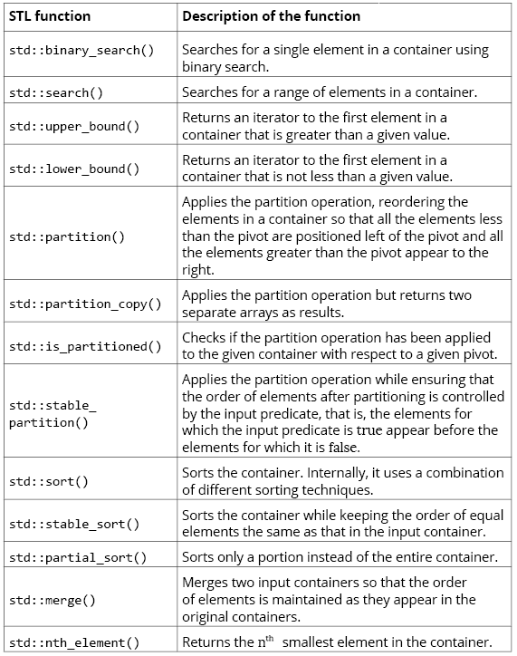

## Lookup
&emsp; 快速查找

#### Hash Table
&emsp;散列表（哈希表）  
Hash，一般翻译做“散列”，也有直接音译为“哈希”的，就是把任意长度的输入，通过散列算法，变换成固定长度的输出，该输出就是散列值  
碰撞: 
* 链地址法，冲突key的值存入链表  
* 开放定址法，通过某种探测技术（线性探测，2次探测），去依次探查其他单元，直到探查到不冲突为止，将元素添加进去  
* 再哈希法，在发生哈希冲突后，使用另外一个哈希算法产生一个新的地址，直到不发生冲突为止  

Perfect Hashing �C Cuckoo Hashing（完美hash-布谷鸟散列）  


load factor 理想状态1，<1 浪费，>1 查找慢 

***

#### Bloom Filter
&emsp;布隆过滤器


##### Divide-and-Conquer
分治法  
- 分解：将原问题分解为若干个规模较小，相互独立，与原问题形式相同的子问题
- 解决：若子问题规模较小而容易被解决则直接解，否则递归地解各个子问题
- 合并：将各个子问题的解合并为原问题的解

##### 归并排序  
外部排序算法，即对不驻留在计算机主内存中的数据进行排序，运行时在内存中保存整个数据的一小部分  
对一个大的元素集进行排序与对一个小的元素子集进行排序是一样的，然后合并排序后的子集，从而保证元素的增加或递减的顺序


---

##### 快速排序
选择基准元素（pivot element)，分区，L（小于P） P R（大于P）  


##### 线性时间选择
第i小元素



##### MapReduce
```MapReduce is a programming model and an associated implementation for processing
and generating large datasets. Users specify a map function that processes a key-value
pair to generate a set of intermediate key/value pairs, and a reduce function that merges
all the intermediate values associated with the same intermediate key.
```

***Map*** is an operation that takes in a container, C, and applies a given function, f(x), to
each element of C. An example of using f(x) = x 2 is shown in the following diagram:  


***Reduce*** is an operation that aggregates values in a container, C, by applying a given
function, f(acc, x), to each element, x, of C, and returning a single value. This is shown in
the following diagram:  
  
The C++ Standard Library contains map and reduce operations, that is std\:\:transform() 
and std\:\:accumulate(), respectively (std\:\:reduce() is also available in
C++ 17).std\:\:reduce() , which is more general and can be parallelized.  

**Generalized MapReduce framework**
 
