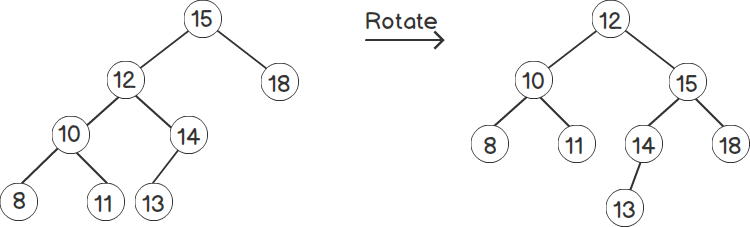

## Non-Linear
&emsp;&emsp;[**tree、heap、graph**]

层次问题（tree），循环依赖（graph）  
 

#### 二叉树遍历
- **Preorder** &emsp;      跟->左子树->右子树 [A, B, C, D, E, F, G, I]
- **In-order** &emsp;      左子树->根->右子树 [C, B, E, D, A, G, F, I]
- **Post-order**&emsp;     左子树->右子树->根 [C, E, D, B, G, I, F, A]
- **Level order**&emsp;    从上向下从左到右 [A, B, F, C, D, G, I, E]

#### Binary Search Tree
&emsp;二叉搜索树， left child ≤ parent ≤ right child  
&emsp;插入，查找O(logn)

&emsp;查找：

***

插入：

***

删除：  
1. 节点无子节点，直接删除
2. 一个子节点，将父节点指向子节点，子节点替换待删除节点
3. 两个子节点，用后继者替换待删除节点，后继者为待删节点右子树中最小的值（最左点，中序遍历后者）  
  

#### Balanced Tree
平衡二叉树定义(AVL)：它或者是一颗空树，或者具有以下性质的二叉排序树：它的左子树和右子树的深度之差(平衡因子)的绝对值不超过1，且它的左子树和右子树都是一颗平衡二叉树  
1. 是二叉搜索树
2. 每个节点的左子树和右子树的高度差至多为1

#### N-ary Tree
多叉树，文件系统，AST抽象语法树

#### heap
堆，完全二叉树， 大顶堆，小顶堆

***

***
delete:  

***

#### Graphs

